# 📘 MANUAL DE USUARIO - JOBHIVE

## Guía Completa para Usar la Plataforma

---

## 📋 ÍNDICE

1. [Objetivos del Manual](#objetivos-del-manual)
2. [Descripción de la Aplicación](#descripción-de-la-aplicación)
3. [Primeros Pasos](#primeros-pasos)
    - [Registro de Cuenta](#registro-de-cuenta)
    - [Confirmación de Correo](#confirmación-de-correo)
    - [Inicio de Sesión](#inicio-de-sesión)
4. [Guía para Candidatos (Usuarios)](#guía-para-candidatos-usuarios)
    - [Navegación de la Interfaz](#navegación-de-la-interfaz)
    - [Ver Empleos Disponibles](#ver-empleos-disponibles)
    - [Postularse a un Empleo](#postularse-a-un-empleo)
    - [Ver Mis Postulaciones](#ver-mis-postulaciones)
    - [Gestionar Mi Perfil](#gestionar-mi-perfil)
    - [Subir Mi Currículum](#subir-mi-currículum)
    - [Analizador de Imágenes (IA)](#analizador-de-imágenes-ia)
5. [Guía para Administradores](#guía-para-administradores)
    - [Navegación del Panel Admin](#navegación-del-panel-admin)
    - [Crear Nuevo Empleo](#crear-nuevo-empleo)
    - [Ver Empleos Publicados](#ver-empleos-publicados)
    - [Gestionar Postulaciones](#gestionar-postulaciones)
    - [Cambiar Estado de Postulaciones](#cambiar-estado-de-postulaciones)
6. [Funciones Especiales](#funciones-especiales)
    - [Modo Oscuro](#modo-oscuro)
    - [Búsqueda y Filtros](#búsqueda-y-filtros)
    - [Notificaciones](#notificaciones)
7. [Preguntas Frecuentes](#preguntas-frecuentes)
8. [Solución de Problemas](#solución-de-problemas)
9. [Consejos y Mejores Prácticas](#consejos-y-mejores-prácticas)

---

## 🎯 OBJETIVOS DEL MANUAL

Este manual ha sido diseñado para ayudarte a:

✅ **Aprender a usar** todas las funciones de JobHive desde cero
✅ **Navegar fácilmente** por la plataforma sin complicaciones
✅ **Aprovechar** las funciones de inteligencia artificial para mejorar tu búsqueda
✅ **Resolver problemas** comunes que puedan surgir
✅ **Maximizar** tus oportunidades de encontrar el empleo ideal

### ¿A quién está dirigido este manual?

-   👤 **Candidatos**: Personas que buscan empleo y desean postularse
-   👔 **Reclutadores/Administradores**: Empresas que publican ofertas y gestionan postulaciones
-   🆕 **Nuevos usuarios**: Personas sin experiencia previa en la plataforma

---

## 📱 DESCRIPCIÓN DE LA APLICACIÓN

### ¿Qué es JobHive?

**JobHive** es una plataforma inteligente de búsqueda y gestión de empleos que conecta a candidatos con oportunidades laborales. Utiliza tecnología de **inteligencia artificial** para:

-   🔍 **Analizar automáticamente** habilidades en imágenes y documentos
-   💼 **Recomendar empleos** que coincidan con tu perfil
-   📧 **Notificar** sobre el estado de tus postulaciones
-   🎯 **Facilitar** el proceso de reclutamiento

### ¿Qué puedo hacer en JobHive?

#### Como Candidato:

-   ✨ Crear tu perfil profesional
-   📄 Subir tu currículum en PDF o imagen
-   🔎 Buscar empleos disponibles
-   📝 Postularte a ofertas laborales
-   📊 Hacer seguimiento de tus postulaciones
-   🖼️ Analizar imágenes con texto (certificados, diplomas) para encontrar empleos

#### Como Administrador:

-   ➕ Publicar nuevas ofertas de empleo
-   👥 Ver todos los candidatos postulados
-   ✅ Gestionar el estado de las postulaciones
-   📈 Ver estadísticas de postulaciones

### Tecnologías que hacen especial a JobHive:

-   🤖 **AWS Rekognition**: Extrae texto de imágenes automáticamente
-   🔊 **Amazon Polly**: Convierte texto a voz para accesibilidad
-   🌐 **Amazon Translate**: Traduce contenido a múltiples idiomas
-   🔒 **AWS Cognito**: Seguridad y autenticación robusta
-   ☁️ **Amazon S3**: Almacenamiento seguro en la nube

---

## 🚀 PRIMEROS PASOS

### Registro de Cuenta

Para comenzar a usar JobHive, primero debes crear una cuenta.

#### Paso 1: Acceder a la pantalla de registro

1. Abre tu navegador web
2. Ingresa a la URL de JobHive
3. En la pantalla de inicio de sesión, haz clic en **"Regístrate aquí"**

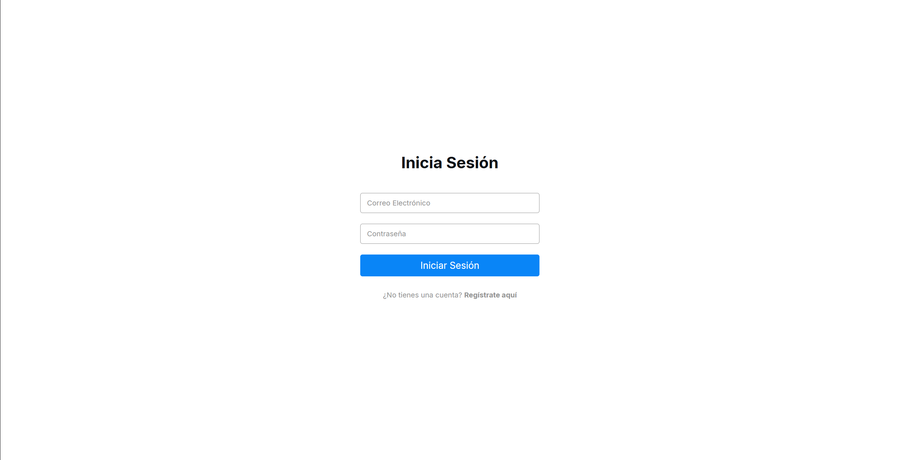

---

#### Paso 2: Completar el formulario de registro

Deberás proporcionar la siguiente información:

| Campo                    | Descripción                          | Ejemplo               |
| ------------------------ | ------------------------------------ | --------------------- |
| **Nombre**               | Tu primer nombre                     | Juan                  |
| **Apellido**             | Tu apellido                          | Pérez                 |
| **Correo Electrónico**   | Email válido (se usará para login)   | juan.perez@email.com  |
| **Fecha de Nacimiento**  | Tu fecha de nacimiento               | 15/03/1995            |
| **Contraseña**           | Mínimo 8 caracteres                  | **\*\*\*\***          |
| **Confirmar Contraseña** | Debe coincidir con la contraseña     | **\*\*\*\***          |
| **Foto de Perfil**       | Imagen de perfil (JPG, PNG, máx 5MB) | [Seleccionar archivo] |

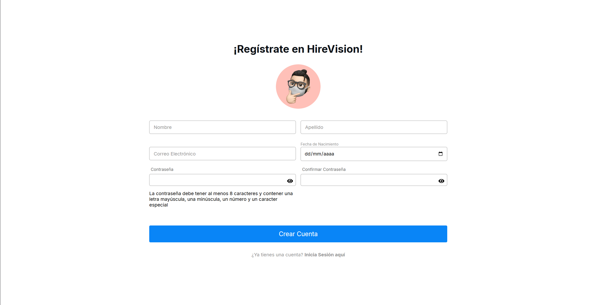

---

#### Paso 3: Subir tu foto de perfil

1. Haz clic en el **círculo de perfil** (icono de usuario)
2. Selecciona una imagen desde tu computadora
3. La imagen se mostrará como vista previa
4. Formatos aceptados: **PNG, JPG, JPEG**
5. Tamaño máximo: **5 MB**

---

#### Paso 4: Validar la contraseña

⚠️ **Requisitos de la contraseña:**

-   Mínimo 8 caracteres
-   Al menos 1 letra mayúscula
-   Al menos 1 letra minúscula
-   Al menos 1 número

💡 **Consejo**: Usa un gestor de contraseñas para mayor seguridad.

---

#### Paso 5: Enviar el formulario

1. Verifica que todos los campos estén completos
2. Haz clic en el botón **"Registrarse"**
3. Espera la confirmación

✅ Si todo es correcto, verás un mensaje:

> **"¡Registro Exitoso! Por favor, revisa tu correo para confirmar tu cuenta"**

---

### Confirmación de Correo

Después de registrarte, debes confirmar tu correo electrónico.


#### Paso 1: Revisar tu correo

1. Abre tu bandeja de entrada del email que registraste
2. Busca un correo de **JobHive** o **AWS Cognito**
3. El asunto será similar a: _"Código de verificación"_


---

#### Paso 2: Obtener el código de 6 dígitos

El email contendrá un código de 6 dígitos, por ejemplo:

```
Tu código de verificación es: 123456
```

⏰ **Importante**: El código expira en 24 horas.

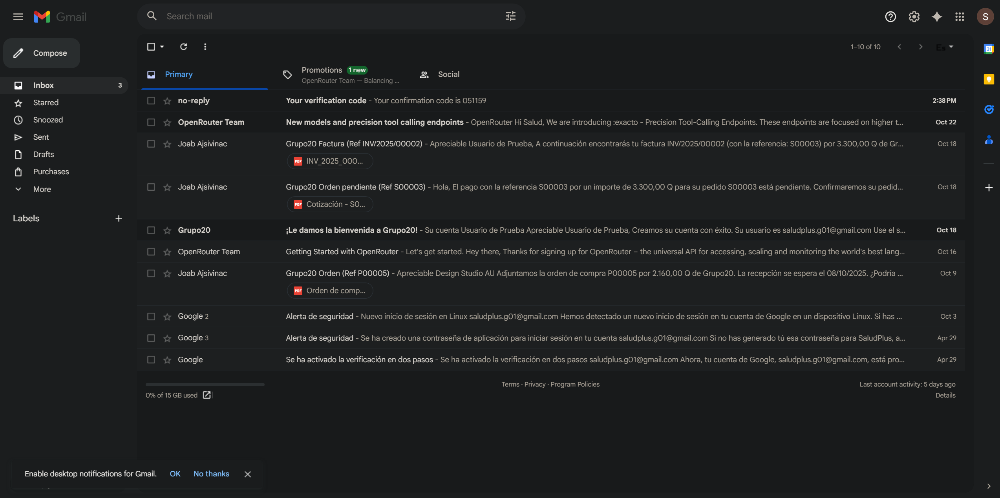

---

#### Paso 3: Ingresar el código en la aplicación

Después del registro, serás redirigido automáticamente a la pantalla de confirmación.

1. Verás **6 casillas** para ingresar el código
2. Escribe un dígito en cada casilla
3. El cursor avanzará automáticamente
4. Al completar los 6 dígitos, la verificación se enviará automáticamente

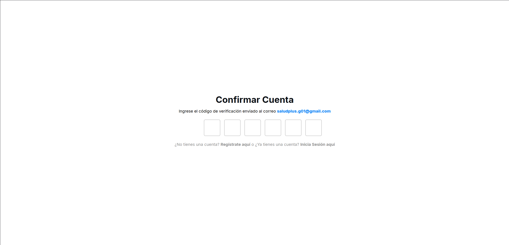

---

#### Paso 4: Confirmación exitosa

✅ Si el código es correcto:

> **"¡Cuenta confirmada exitosamente!"**

Serás redirigido a la pantalla de **inicio de sesión**.

❌ Si el código es incorrecto:

> **"Código inválido. Por favor, verifica e intenta nuevamente"**

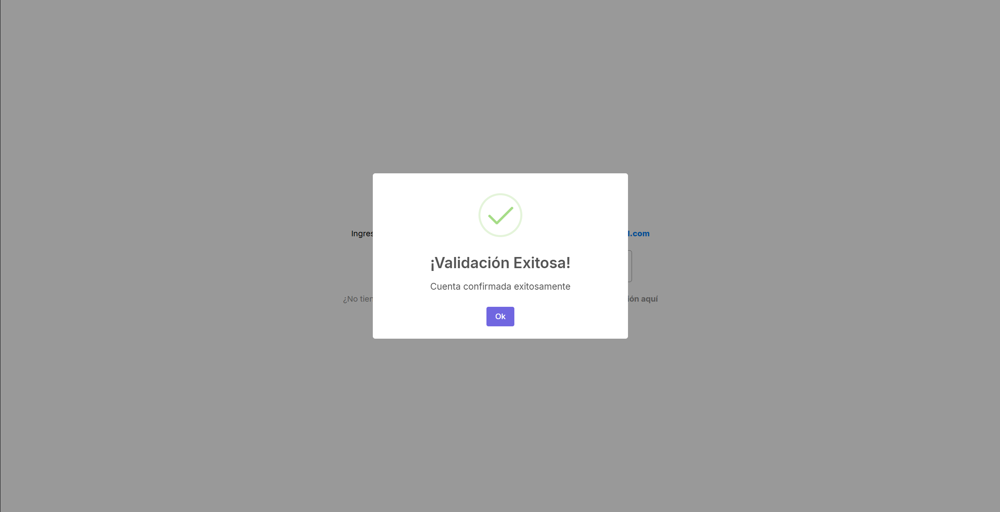


---

### Inicio de Sesión

Una vez confirmada tu cuenta, ya puedes iniciar sesión.

#### Paso 1: Acceder a la pantalla de login

1. Ingresa a la URL de JobHive
2. Verás la pantalla de **Inicio de Sesión**


---

#### Paso 2: Ingresar credenciales

1. **Correo Electrónico**: El email que registraste
2. **Contraseña**: La contraseña que creaste


---

#### Paso 3: Hacer clic en "Iniciar Sesión"

Después de presionar el botón:

-   ✅ **Si es exitoso**: Serás redirigido a tu panel principal

    -   **Usuarios**: Panel de candidato con empleos disponibles
    -   **Administradores**: Panel de administración con gestión de empleos

-   ❌ **Si falla**: Verás un mensaje de error
    -   "Usuario o contraseña incorrectos"
    -   "Usuario no confirmado" (debes verificar tu email)


---

## 👤 GUÍA PARA CANDIDATOS (USUARIOS)

Una vez iniciada la sesión como candidato, accederás al panel principal.

### Navegación de la Interfaz

La interfaz de usuario está dividida en tres secciones principales:

#### 1. Barra Superior (TopBar)

Contiene:

-   **Menú hamburguesa** (izquierda): Abre/cierra el menú lateral
-   **Logo de JobHive** (centro)
-   **Modo oscuro** (derecha): Alterna entre tema claro y oscuro
-   **Cerrar sesión** (derecha): Cierra tu sesión


---

#### 2. Menú Lateral (Sidebar)

Accede a las diferentes secciones:

| Icono | Sección               | Descripción                       |
| ----- | --------------------- | --------------------------------- |
| 💼    | **Empleos**           | Ver todas las ofertas disponibles |
| 📄    | **Mis Postulaciones** | Ver el estado de tus aplicaciones |
| 👤    | **Mi Perfil**         | Gestionar tu información personal |
| 🖼️    | **Analizar Imagen**   | Usar IA para detectar habilidades |

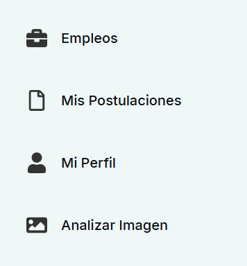


---

#### 3. Panel Principal (Contenido)

Muestra el contenido de la sección seleccionada.

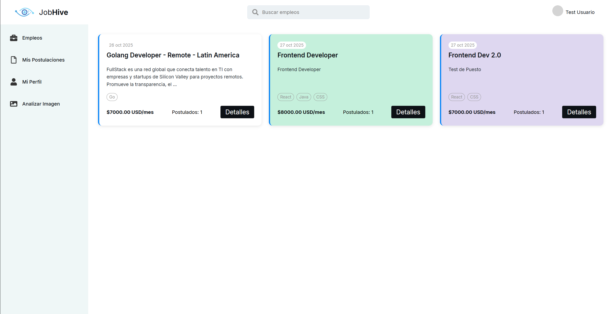


---

### Ver Empleos Disponibles

Por defecto, al iniciar sesión verás la sección de **Empleos**.

#### Visualización de ofertas

Cada tarjeta de empleo muestra:

-   **Puesto**: Título del empleo (ej: "Desarrollador Full Stack")
-   **Salario**: Salario mensual (ej: "$3,500 USD/mes")
-   **Fecha de publicación**: Cuándo se creó la oferta
-   **Habilidades requeridas**: Tecnologías o skills (ej: React, Node.js, AWS)
-   **Número de postulados**: Cuántas personas han aplicado
-   **Descripción**: Resumen breve del puesto

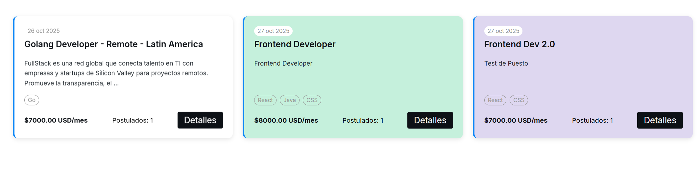


---

#### Interactuar con una oferta

Cada tarjeta tiene dos botones:

1. **👁️ "Ver Detalles"**: Abre una ventana con información completa
2. **✅ "Postularme"**: Te postula directamente al empleo


---

### Postularse a un Empleo

#### Opción 1: Postulación desde la tarjeta

**Paso 1:** Haz clic en el botón **"Postularme"** en la tarjeta del empleo

**Paso 2:** Aparecerá una confirmación

**Paso 3:** El sistema:

-   Registra tu postulación en la base de datos
-   Envía un email de confirmación a tu correo
-   Actualiza el contador de postulados

✅ **Mensaje de éxito:**

> "¡Postulación enviada exitosamente!"


---

#### Opción 2: Postulación desde modal de detalles

**Paso 1:** Haz clic en **"Ver Detalles"** en una tarjeta de empleo

**Paso 2:** Se abrirá un **modal** (ventana emergente) con:

-   Descripción completa del puesto
-   Lista detallada de habilidades
-   Salario y beneficios
-   Información de la empresa (si aplica)

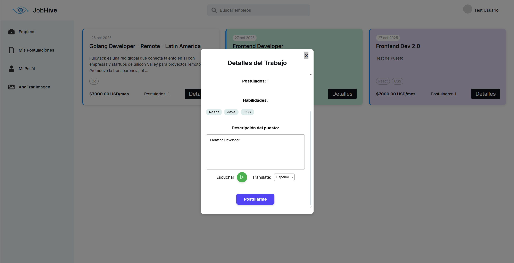


---

**Paso 3:** En el modal, haz clic en el botón **"Postularme"**

**Paso 4:** Confirma tu postulación

✅ **Ventajas de postularse:**

-   Proceso simple y rápido
-   Notificaciones por email
-   Seguimiento del estado de tu aplicación


---


### Ver Mis Postulaciones

Para ver el seguimiento de tus aplicaciones:

#### Paso 1: Acceder a la sección

1. Abre el **menú lateral**
2. Haz clic en **"Mis Postulaciones"** 📄

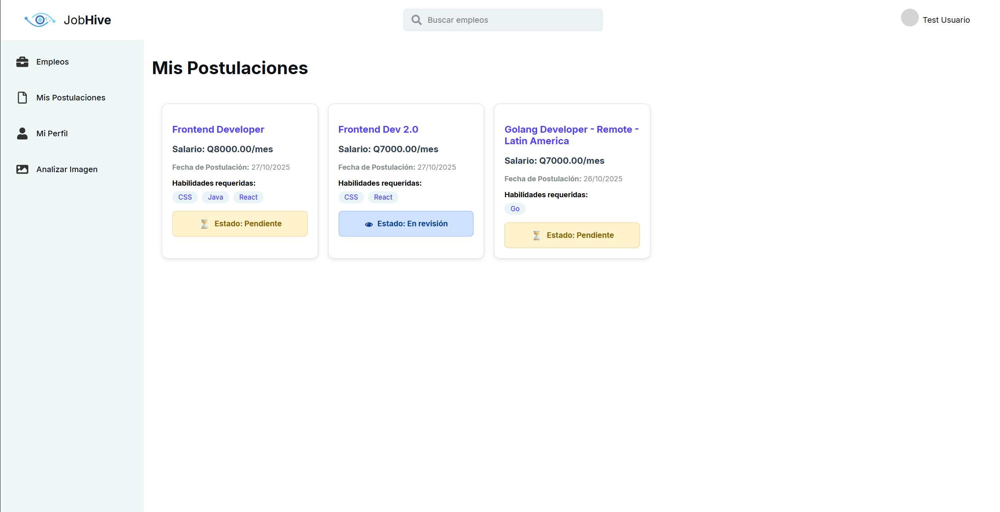

---

#### Paso 2: Visualizar tus aplicaciones

Verás una lista de todas tus postulaciones con:

| Información              | Descripción                      |
| ------------------------ | -------------------------------- |
| **Puesto**               | Nombre del empleo                |
| **Empresa**              | Nombre de la empresa (si aplica) |
| **Fecha de postulación** | Cuándo aplicaste                 |
| **Salario**              | Oferta salarial                  |
| **Estado**               | Estatus actual de tu aplicación  |
| **Habilidades**          | Skills requeridas                |


---

#### Paso 3: Entender los estados de postulación

Cada postulación tiene un **estado** con colores distintivos:

| Estado             | Color       | Icono | Significado                                 |
| ------------------ | ----------- | ----- | ------------------------------------------- |
| **⏳ Pendiente**   | 🟡 Amarillo | ⏳    | Tu aplicación fue recibida, aún no revisada |
| **👁️ En revisión** | 🔵 Azul     | 👁️    | El reclutador está evaluando tu perfil      |
| **✅ Aceptado**    | 🟢 Verde    | ✓     | ¡Felicitaciones! Fuiste seleccionado        |
| **❌ Rechazado**   | 🔴 Rojo     | ✗     | No fuiste seleccionado en esta ocasión      |

---

### Gestionar Mi Perfil

Accede a tu información personal y actualízala cuando sea necesario.

#### Paso 1: Abrir Mi Perfil

1. Abre el **menú lateral**
2. Haz clic en **"Mi Perfil"** 👤

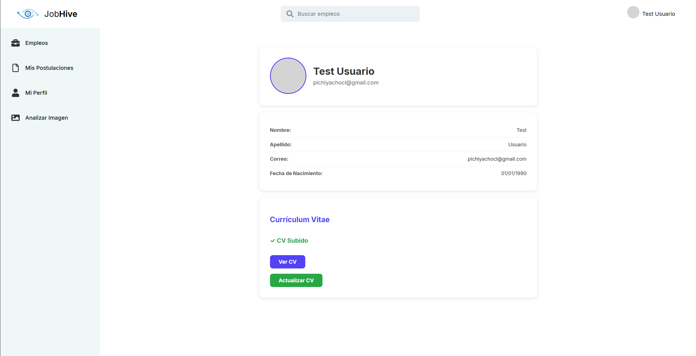


---

#### Paso 2: Visualizar tu información

Tu perfil muestra:

**Sección 1: Información de encabezado**

-   📸 **Foto de perfil**
-   👤 **Nombre completo**
-   📧 **Correo electrónico**
-   🔖 **Rol** (Usuario o Administrador)


---

**Sección 2: Detalles personales**

-   📝 **Nombre**
-   📝 **Apellido**
-   📧 **Correo**
-   🎂 **Fecha de Nacimiento**


---

**Sección 3: Currículum Vitae**

-   📄 **Estado del CV**: "CV subido" o "No has subido tu CV"
-   🔗 **Link para ver/descargar** tu CV (si ya lo subiste)
-   ⬆️ **Botón para subir/actualizar** tu CV


---

### Subir Mi Currículum

Tener un CV actualizado aumenta tus probabilidades de ser contratado.

#### Paso 1: Acceder a la sección de CV

Desde **"Mi Perfil"**, localiza la sección de **"Currículum Vitae"**.


---

#### Paso 2: Hacer clic en "Subir CV"

1. Haz clic en el botón **"Subir Currículum"** o **"Actualizar CV"**
2. Se abrirá un **modal** (ventana emergente)

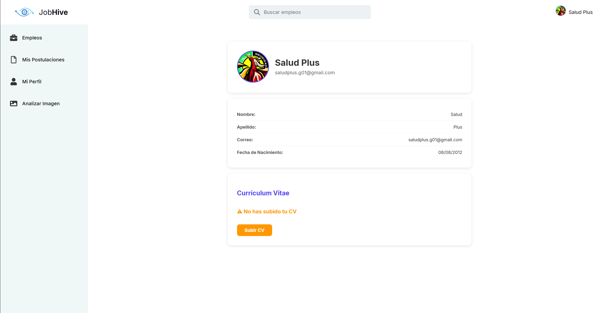


---

#### Paso 3: Seleccionar tu archivo

Puedes subir tu CV en los siguientes formatos:

| Formato    | Extensión   | Tamaño Máximo |
| ---------- | ----------- | ------------- |
| PDF        | .pdf        | 5 MB          |

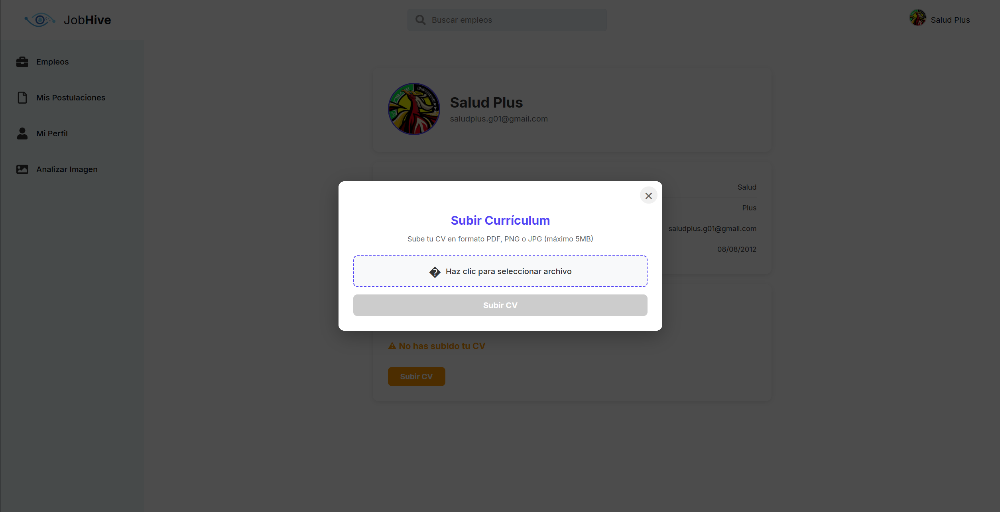


---

**Paso 4:** Arrastra el archivo o haz clic para buscar

1. **Opción A**: Arrastra tu archivo al área indicada
2. **Opción B**: Haz clic en **"Seleccionar archivo"** y búscalo en tu computadora


---


#### Paso 6: Subir el archivo

1. Haz clic en el botón **"Subir"**
2. Espera mientras el archivo se procesa

---

#### Paso 6: Confirmación exitosa

✅ **Mensaje de éxito:**

> "¡CV subido exitosamente!"

El sistema:

-   Almacena tu CV en la nube (AWS S3)
-   Actualiza tu perfil automáticamente
-   Cierra el modal después de 2 segundos


---

#### Paso 7: Ver tu CV subido

Después de subir tu CV:

-   En tu perfil aparecerá un **link** con el texto **"Ver mi CV"**
-   Haz clic para **abrir** tu CV en una nueva pestaña
-   Los reclutadores también podrán verlo cuando revisen tu postulación

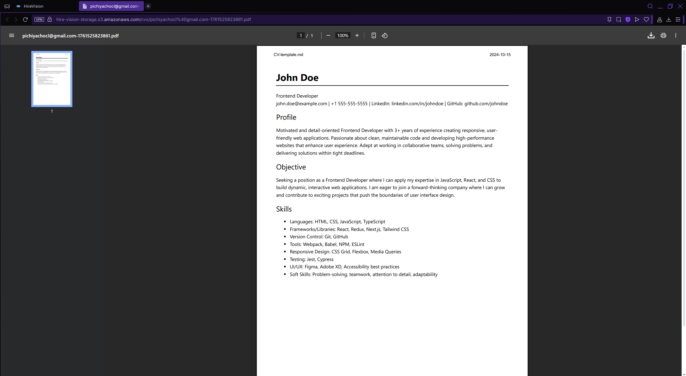


---

### Analizador de Imágenes (IA)

Una de las funciones más **innovadoras** de JobHive. Usa inteligencia artificial para analizar imágenes con texto.

#### ¿Para qué sirve?


🤖 **La IA detecta automáticamente:**

-   Tecnologías mencionadas (React, Python, AWS, etc.)
-   Habilidades técnicas
-   Certificaciones

💼 **Recibe recomendaciones:**

-   Empleos que coincidan con las habilidades detectadas
-   Porcentaje de compatibilidad con cada oferta

---

#### Paso 1: Acceder al Analizador de Imágenes

1. Abre el **menú lateral**
2. Haz clic en **"Analizar Imagen"** 🖼️


---

#### Paso 2: Vista del Analizador

La pantalla de análisis tiene dos secciones:

**Sección A: Subida de imagen**

-   Área para seleccionar imagen
-   Botón "Seleccionar imagen"
-   Botón "Analizar"

**Sección B: Resultados**

-   Habilidades detectadas
-   Empleos recomendados

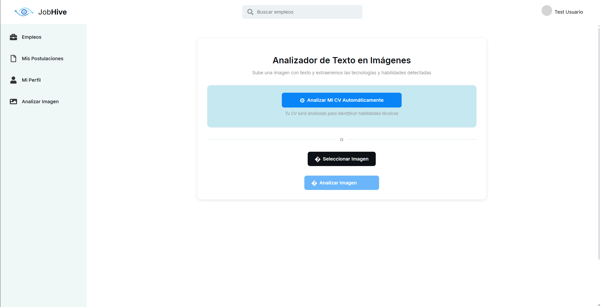


---

#### Paso 4: Vista previa de la imagen

Una vez seleccionada:

-   Verás una **vista previa** de tu imagen
-   Puedes cancelar y elegir otra si es necesario

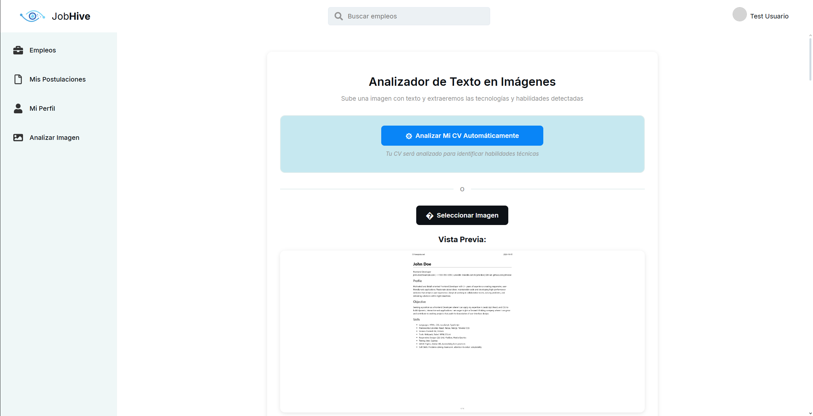


---

#### Paso 5: Analizar la imagen

1. Haz clic en el botón **"Analizar"**
2. Aparecerá un **indicador de carga**
3. El proceso toma entre 2-5 segundos

Durante el análisis, la IA (AWS Rekognition):

-   Extrae todo el texto de la imagen
-   Identifica palabras clave relacionadas con habilidades técnicas
-   Busca coincidencias en la base de datos de empleos


---

#### Paso 6: Ver resultados del análisis

Después del análisis, verás dos secciones:

**📋 Sección 1: Habilidades detectadas**

Lista de habilidades/tecnologías encontradas:

-   React
-   Node.js
-   AWS
-   Python
-   JavaScript
-   MySQL
-   etc.

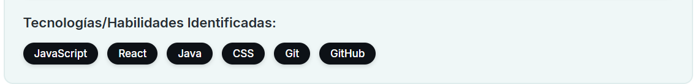


---

**💼 Sección 2: Empleos recomendados**

Muestra empleos que requieren las habilidades detectadas:

Cada empleo muestra:

-   **Título del puesto**
-   **Salario**
-   **Porcentaje de coincidencia** (ej: 80% match)
-   **Habilidades que coinciden**
-   **Botón "Postularme"**

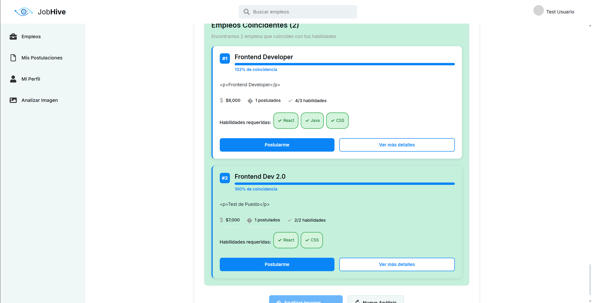


---

#### Paso 7: Postularse desde recomendaciones

1. Revisa las ofertas recomendadas
2. Haz clic en **"Postularme"** en el empleo que te interese
3. Confirma tu postulación

✅ **Ventaja:**

-   Las recomendaciones tienen alta probabilidad de éxito
-   Ya cumples con la mayoría de requisitos


---


## 👔 GUÍA PARA ADMINISTRADORES

Si eres un reclutador o administrador de la plataforma, tendrás acceso a funciones especiales.

### Navegación del Panel Admin

El panel de administrador es diferente al de usuario.

---

#### Menú Lateral (Admin)

Opciones disponibles:

| Icono | Sección        | Descripción                  |
| ----- | -------------- | ---------------------------- |
| 💼    | **Empleos**    | Gestionar ofertas publicadas |
| 📄    | **Postulados** | Ver y gestionar candidatos   |


---

### Crear Nuevo Empleo

Como administrador, puedes publicar ofertas laborales.

#### Paso 1: Acceder a la sección de Empleos

Por defecto, al iniciar sesión como admin verás la sección de **Empleos**.

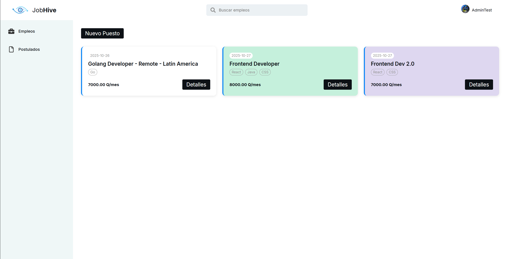


---

#### Paso 2: Hacer clic en "Nuevo Puesto"

En la parte superior de la pantalla:

1. Haz clic en el botón **"Nuevo Puesto"**
2. Se abrirá un **modal** (formulario)

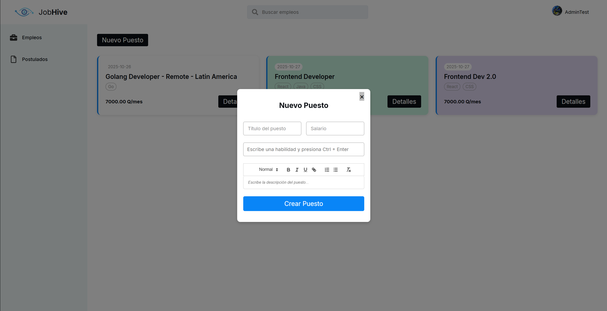


---

#### Paso 3: Completar el formulario

El formulario de creación de empleo tiene los siguientes campos:

| Campo           | Descripción                                       | Ejemplo                                      |
| --------------- | ------------------------------------------------- | -------------------------------------------- |
| **Puesto**      | Título del empleo                                 | Desarrollador Full Stack Senior              |
| **Descripción** | Detalles del puesto (editor de texto enriquecido) | Buscamos un desarrollador con experiencia... |
| **Salario**     | Salario mensual en USD                            | 3500                                         |
| **Habilidades** | Tecnologías requeridas (separadas por comas)      | React, Node.js, AWS, MySQL                   |


---

#### Paso 4: Usar el editor de descripción

La **descripción** usa un editor de texto enriquecido (Rich Text Editor):

Funciones disponibles:

-   **Negrita**, _cursiva_, <u>subrayado</u>
-   Listas con viñetas
-   Listas numeradas
-   Enlaces
-   Tablas (opcional)

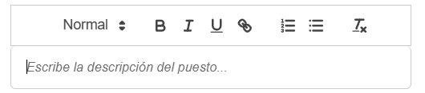

---

#### Paso 5: Agregar habilidades

En el campo de **Habilidades**:

1. Escribe el nombre de una habilidad
2. Presiona **Enter** o agrega **coma (,)**
3. Se creará una etiqueta visual
4. Repite para agregar más habilidades

Ejemplo:

```
React, Node.js, MongoDB, Express, AWS, Docker
```

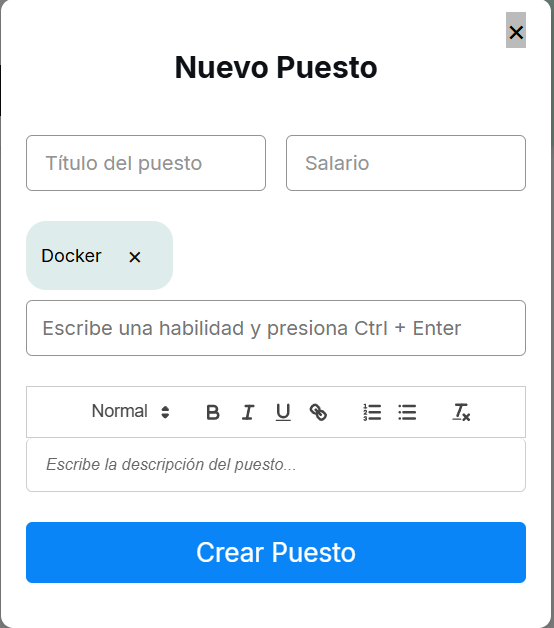


---

#### Paso 6: Publicar el empleo

1. Revisa que todos los campos estén completos
2. Haz clic en el botón **"Crear Empleo"** o **"Publicar"**
3. Espera la confirmación

✅ **Mensaje de éxito:**

> "¡Empleo publicado exitosamente!"

El modal se cerrará y verás tu nueva oferta en la lista.


---

### Ver Empleos Publicados

Todos los empleos que has publicado aparecen en la sección de **Empleos**.

#### Visualización de ofertas

Cada tarjeta de empleo muestra:

-  **Puesto**: Título del empleo
-  **Salario**: Salario mensual
-  **Fecha de publicación**: Cuándo se creó
-  **Habilidades**: Tecnologías requeridas
-  **Número de postulados**: Cuántos candidatos aplicaron


---

### Gestionar Postulaciones

Esta es la función más importante para reclutadores.

#### Paso 1: Acceder a Postulados

1. Abre el **menú lateral**
2. Haz clic en **"Postulados"** 


---

#### Paso 2: Visualizar candidatos

Verás una lista de **todas las postulaciones** recibidas:

**Información mostrada:**

| Columna                  | Descripción                   |
| ------------------------ | ----------------------------- |
| **Foto**                 | Foto de perfil del candidato  |
| **Nombre**               | Nombre completo del postulado |
| **Puesto**               | Empleo al que aplicó          |
| **Salario**              | Salario ofrecido              |
| **Fecha de postulación** | Cuándo aplicó                 |
| **Estado**               | Estado actual                 |
| **CV**                   | Link para ver el currículum   |
| **Acciones**             | Cambiar estado                |

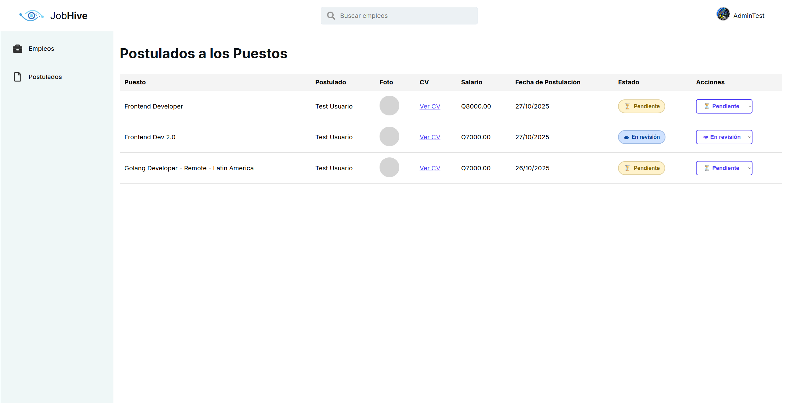


---

#### Paso 3: Ver el CV del candidato

1. Localiza la columna **"CV"**
2. Haz clic en el **link "Ver CV"**
3. Se abrirá el currículum en una nueva pestaña


---

### Cambiar Estado de Postulaciones

Como reclutador, puedes actualizar el estado de cada candidato.

#### Paso 1: Localizar el selector de estado

En cada fila de la tabla, hay un **menú desplegable** con el estado actual.

Estados disponibles:

-  **Pendiente**
-  **En revisión**
-  **Aceptado**
-  **Rechazado**


---

#### Paso 2: Cambiar el estado

1. Haz clic en el **dropdown** (menú desplegable)
2. Selecciona el nuevo estado
3. El cambio se guarda automáticamente


---

#### Paso 3: Confirmación del cambio

Después de cambiar el estado:

 **Mensaje de éxito:**

> "Estado actualizado correctamente"

El sistema:

-   Actualiza la base de datos
-   Cambia el color del estado en la tabla
-   Notifica al candidato por email (opcional)


---


##  FUNCIONES ESPECIALES

### Notificaciones

JobHive envía notificaciones por **email** en eventos importantes:

#### Candidatos reciben emails cuando:

1. **Registran su cuenta** (código de verificación)
2. **Confirman su email** (bienvenida)


